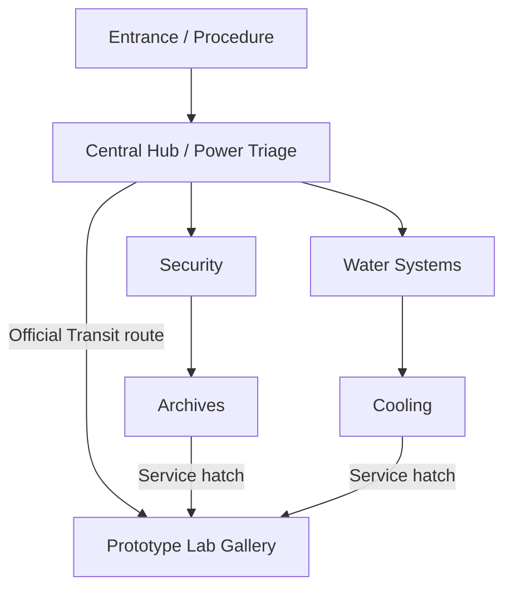
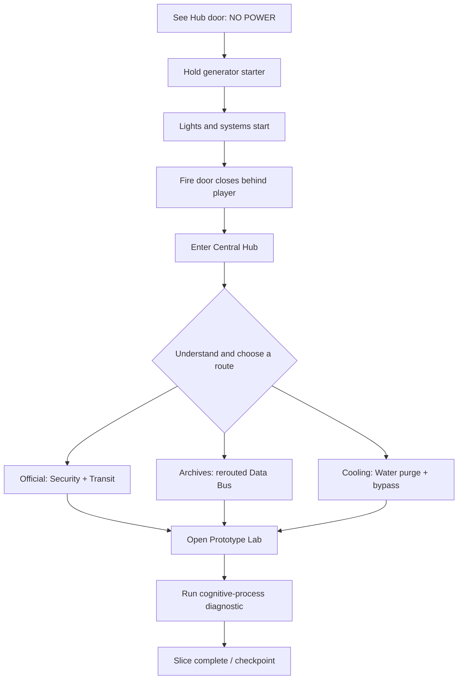
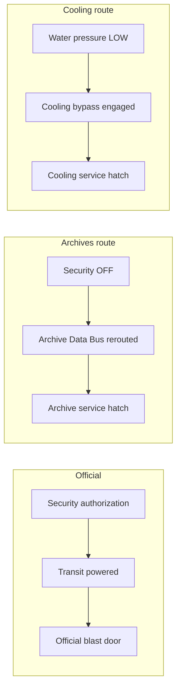

# Facility Playable Slice — Technical GDD

## Status

- Design approved during the 2026-08-29/30 facility flow brainstorm.
- Target scene: [`quest_world/levels/facility.tscn`](../../../quest_world/levels/facility.tscn).
- Scope: a 15–20 minute playable slice ending with the first cognitive-process diagnostic.
- Implementation ownership: the interactables are intentionally left for the project owner to implement in order to evaluate the strengths and friction points of the QuestWorld frameworks.

This document freezes the intended player flow, systemic dependencies, interaction inventory and level-design changes. It does not specify the later Prototype Lab puzzle or detailed dialog writing.

## Slice Promise

The slice must prove the following loop from the [project one-pager](../../one-pager.md):

> Reconfiguration → Consequence → Comprehension → New choice

The player is given one mandatory spatial sequence only:

```text
Entrance → Central Hub → one valid access to the Prototype Lab
```

Security, Archives, Water Systems and Cooling are possible means, sources of information and sources of consequences. They are not a checklist. A player may miss rooms or information, then revisit them after reconfiguring the station.

## Goals

- Teach that activating a system can have a negative consequence.
- Make power routing a physical, legible world state rather than an abstract menu.
- Offer three systemic routes to the same laboratory.
- Let solo and coop use the same world and content while producing different strategies.
- Give coop one genuine two-player-only advantage without gating exclusive content.
- Use the auxiliary cell as a movable exception to the network, not as a colored key.
- End with a diagnostic that reports the actual world state without judging it as good or bad.
- Exercise Interaction, Stateful, Inventory and Quest/Flow in a real gameplay context.

## Non-goals

- The internal Prototype Lab puzzle and extraction choice.
- Final dialog, voice direction or contradictory-order scripting.
- A real-time failure timer for Cooling or Water Systems.
- Damage gameplay for heat and overflow hazards.
- Making every colored blockout prop interactable.
- Implementing or reopening the Entrance fire door during this slice.

## Spatial Graph



The Hub remains the spatial and conceptual center. Security and Water Systems are the first lateral destinations visible from it. Archives and Cooling are discovered behind those rooms. All three laboratory entrances converge into the same observation gallery.

## Macro Player Flow



The Entrance is a short directed tutorial. Freedom begins in the Central Hub.

## Power Model

The emergency generator provides a capacity of `3` visible units.

| Circuit | Cost | Initial state | Primary effect |
| --- | ---: | --- | --- |
| Cooling | 2 | ON | Keeps the cognitive process thermally stable |
| Security | 1 | ON | Enables telemetry and official authorization |
| Transit | 2 | OFF | Powers the official Prototype blast door |
| Archives | 1 | OFF | Powers archive terminals and the Archive Data Bus |

Initial load after the generator starts:

```text
Cooling  2 — ON
Security 1 — ON
Transit  2 — OFF
Archives 1 — OFF
             3/3
```

Rules:

- Each circuit has a physical breaker with explicit ON/OFF actions.
- Turning OFF a circuit is always allowed.
- Turning ON a circuit is refused when its cost would exceed current capacity.
- The refusal states the missing capacity, for example `INSUFFICIENT CAPACITY — SHED 2`.
- Cooling OFF immediately changes presentation and records `degrading`; it does not start a hidden real-time countdown.
- A temporary emergency coupler can raise capacity from `3` to `5` only while its interaction is held.

This model intentionally uses small values rather than fictional kilowatt arithmetic. It should be readable from physical breakers, a load gauge and lit cable routes without opening a dedicated UI.

## Laboratory Routes



| Route | Required preparation | Final power configuration | Primary consequence |
| --- | --- | --- | --- |
| Official solo | Persistent authorization from Security; Transit powered | Transit 2 + Security 1 | Cooling becomes `degrading` |
| Official coop | Security authorization; one player holds the emergency coupler while the other charges the Transit console | Temporary load 5 | Cooling remains stable; same content, better world state |
| Archives | Security OFF; Archive Data Bus rerouted | Cooling 2 + Archives 1 | Security telemetry is lost; archive terminals are sacrificed to the hatch |
| Cooling solo | Pump B cell removed; automatic purge active; Cooling bypass engaged | Cooling 2 + Security 1 | Pump B stops and Water enters `overflow_warning` until restored |
| Cooling coop | One player manually holds the purge while the other engages the bypass | Cooling 2 + Security 1 | Pump B and its cell remain in place |

No route is labeled correct. The diagnostic reports the resulting facts.

## Coop Contract

- No room, narrative fact or critical-path completion is exclusive to coop.
- Two players benefit from occupying distant positions, observing remote effects and carrying out work in parallel.
- The Water/Cooling purge is faster and cheaper with two players, but the auxiliary cell provides the solo equivalent.
- The official-route emergency transfer is the one intentionally coop-only operation.
- Coop-only advantage means preserving a better world state, not unlocking exclusive content.
- The emergency transfer still requires Security authorization; it is not a one-button route.

### Official emergency transfer

1. Obtain persistent Transit authorization in Security.
2. Return to the Hub without cutting Cooling.
3. Player A holds the spring-loaded emergency bus coupler.
4. Player B performs the long `OPEN PROTOTYPE BLAST DOOR` charge at the Transit console.
5. Releasing the coupler before completion cancels the charge.
6. Once opened, the blast door remains physically open when the overload ends.

The coupler and Transit console must be visible to each other but far enough apart that one character cannot operate both.

## Interaction Inventory

### Entrance

#### Hub access door

- Action: `OPEN`.
- Initial state: `closed`.
- Rule before generator startup: blocked with `NO POWER`.
- After startup: opens normally and remains physically open.
- Purpose: expose a blocked systemic dependency before presenting its solution.

#### Emergency generator starter

- Action: `START EMERGENCY GENERATOR`.
- Execution: approximately three-second hold.
- States: `offline → starting → online`.
- The generator latches online and cannot be stopped from this local starter.
- Effects: activates lighting, ventilation, Hub power and the default Cooling + Security configuration.
- Negative effect: automatically closes and seals the Entrance fire door.

#### Entrance fire door

- Reactive world object, not a required player interaction.
- States: `opened → closing → sealed`.
- Optional blocked affordance: `REMOTE RELEASE REQUIRED`.
- Reopening it is explicitly deferred unless later playtesting gives it a meaningful backtracking role.

The existing Entrance auxiliary-cell dock is removed from this slice.

### Central Hub

#### Circuit breakers

Four distinct physical levers expose contextual `TURN ON` and `TURN OFF` actions for Cooling, Security, Transit and Archives. They enforce the capacity rules above and update the world immediately.

#### Load gauge and routing display

- Reactive presentation, not necessarily interactable.
- Displays active circuits, individual costs, total load and overload state.
- Physical cable lights show which rooms receive power.

#### Emergency bus coupler

- Action: `HOLD EMERGENCY BUS COUPLER`.
- Active only while held.
- Raises transient capacity to `5`.
- A solo player is allowed to hold it; the spatial layout, not a `2 PLAYERS REQUIRED` rule, prevents solo use of the remote console.

#### Transit console

- Visible intention: `OPEN PROTOTYPE BLAST DOOR`.
- Normal availability: Transit powered and Security authorization granted.
- Coop availability: Security authorization granted and emergency coupler currently held.
- Coop execution is a sustained charge and cancels if the coupler is released.
- Completion opens the blast door persistently.

The framework implementation may model normal and emergency execution as two hidden/contextual actions sharing a label or as one action with a composed rule and contextual executor. The implementation should expose which approach fits the framework cleanly.

### Security

#### Security checkpoint

- Reactive powered threshold.
- Security ON: normal route open.
- Security OFF: main checkpoint closed, but a standing-height maintenance gap remains usable.
- It must never trap a solo player away from the Hub.

#### Operations console

- `AUTHORIZE PROTOTYPE TRANSIT`: available with Security ON; sets a persistent authorization fact.
- `REVIEW PROTOTYPE TELEMETRY`: optional information about Cooling and the distributed process.
- Previously granted authorization survives Security being turned OFF.

#### Telemetry rack

- Reactive presentation.
- Security ON: process components are located and displayed.
- Security OFF: `TRACKING LOST`.
- Loss of telemetry changes the final diagnostic but blocks no route.

### Archives

#### Archive entrance door

- `OPEN` requires Archives ON.
- It requires no inventory key or abstract clearance.
- Once opened, it remains physically open after power loss.

#### Scientific terminal

- Optional log interaction.
- Provides Cooling and early continuity context.
- Never supplies an invisible mandatory quest flag.

#### Archive Data Bus terminal

- Action: `REROUTE DATA BUS TO LAB SERVICE HATCH`.
- Execution: long interaction.
- Rules: Archives ON and Security OFF.
- State: `archives → service_hatch`.
- Effect: powers the west laboratory hatch and turns Archive terminals off.
- The reroute remains until deliberately restored later.

#### Continuity Records

- Fully optional information interaction.
- Hints that stable states are not merely technical backups without completing the human-identity reveal.

#### Archive service hatch

- Action: `RELEASE MAINTENANCE HATCH`.
- Rule: Archive Data Bus routed to `service_hatch`.
- Completion opens the route persistently.

The current Mobile Archive Cart is removed until it has a systemic purpose.

### Water Systems

#### Pump B auxiliary cell

- `REMOVE AUXILIARY CELL`: stops Pump B and adds the cell to inventory.
- `REINSTALL AUXILIARY CELL`: removes it from inventory and restarts Pump B.
- Removing the cell immediately changes Water Systems from `stable` to `overflow_warning`.
- Restoring it returns the system progressively to `stable`.

#### Purge control

- `HOLD MANUAL PURGE`: pressure is `low` only while held.
- `INSTALL AUXILIARY CELL`: consumes the carried cell and holds the purge automatically.
- `REMOVE AUXILIARY CELL`: returns the cell and restores normal pressure.
- Both manual and automatic methods produce the same shared pressure state and remote feedback.

#### Overflow presentation

- Reactive hazard presentation rather than a damage system.
- Shows water accumulation, pump audio changes and warnings.
- Does not use a hidden timer or create an irreversible failure in this slice.

### Cooling

#### Chillers and instrumentation

- Reactive presentation rather than individual interactions.
- Cooling ON: normal operation.
- Cooling OFF: machinery stops, lighting changes, heat presentation activates and the process becomes `degrading`.

#### Emergency bypass

- Action: `ENGAGE LAB COOLANT BYPASS`.
- Execution: long interaction.
- Rules: Cooling ON and Water pressure `low`.
- If pressure stops being `low` during execution, the running interaction is cancelled.
- Completion mechanically latches the bypass and releases the east laboratory hatch.

#### Cooling service hatch

- Action: `OPEN SERVICE HATCH` after bypass engagement.
- Opens persistently.
- Pressure may return to normal after it opens without closing the passage.

The current Hot Zones remain presentation-only during this slice.

### Prototype Lab gallery

#### Cognitive-process diagnostic console

- Action: `RUN COGNITIVE PROCESS DIAGNOSTIC`.
- Reads current world states directly.
- Can be rerun after later reconfiguration.
- Completes the slice quest at `prototype_diagnostic_complete` and creates the slice checkpoint.

Example result after the official solo route:

```text
COGNITIVE PROCESS RECOVERY
PROCESS THERMAL STATE: DEGRADING
SECURITY TELEMETRY: ONLINE
ARCHIVE CONTINUITY DATA: UNAVAILABLE
WATER SYSTEMS: STABLE
MULTIPLE SUBSTRATE NODES DETECTED
```

Example result after the Archives route:

```text
COGNITIVE PROCESS RECOVERY
PROCESS THERMAL STATE: STABLE
SECURITY TELEMETRY: LOST
ARCHIVE DATA BUS: REROUTED
MULTIPLE SUBSTRATE NODES DETECTED
```

The diagnostic never displays a moral score or a `GOOD/BAD` result.

## Suggested World States

These names document gameplay truth, not a request for one global state machine.

| Owner | Suggested states/facts |
| --- | --- |
| Generator | `offline`, `starting`, `online` |
| Entrance fire door | `opened`, `closing`, `sealed` |
| Each circuit | `off`, `on` |
| Cooling process | `stable`, `degrading` |
| Security authorization | `not_granted`, `granted` |
| Security telemetry | `online`, `lost` |
| Archive Data Bus | `archives`, `service_hatch` |
| Pump B | `running`, `stopped` |
| Water Systems | `stable`, `overflow_warning` |
| Water pressure | `normal`, `low` |
| Cooling bypass | `closed`, `engaged` |
| Each laboratory access | `closed`, `opened` |
| Slice quest | `procedure`, `triage`, `lab_accessible`, `prototype_diagnostic_complete` |

Derived values such as current load should be calculated from circuit states rather than stored as an independent competing truth.

## Level Design Changes

### Entrance

The current `ParkedFireDoor` block in a corner does not block a route and does not read as a door. Replace it with a complete sliding fire door at the decontamination threshold:

- It fills the opening between the decontamination dividers when closed.
- Its open pose sits in a visible wall pocket.
- The player crosses it before reaching the generator.
- The starter is oriented so the closure is visible peripherally or immediately upon turning.
- Sound, warning light and loss of light toward check-in reinforce causality.

The Hub access door must also fill its complete threshold and show `NO POWER` before the player reaches the starter.

### Central Hub

The first visual read from the Entrance is:

```text
             PROTOTYPE BLAST DOOR
                       ↑
SECURITY ← POWER ROUTING ISLAND → WATER
                       ↑
                    ENTRANCE
```

- Keep the Prototype blast door directly opposite the Entrance.
- Put the `3/3` load gauge and circuit diagram on the central island.
- Group the four physical breakers on one readable face.
- Route visible cable lights from the island toward their corresponding wings.
- Place the emergency coupler on the south-west side of the island.
- Move the Transit console beside the Prototype blast door.
- Preserve line of sight but enough distance between coupler and console to prevent solo operation.
- Replace the parked red block and narrow uprights with a complete double blast door that fills the corridor.

### Security

- Show the operations console immediately beyond the checkpoint.
- Keep the unpowered Archives threshold visible farther behind it.
- Place authorization far enough inside the room to require actual entry.
- Make the telemetry rack face the incoming player.
- Turn `CheckpointGapMarker` into a standing-height maintenance route usable when Security is OFF.

### Archives

- Replace the undersized swinging entrance door with a threshold-sized powered door.
- Make the laboratory hatch visible from the entrance with `NO SERVICE POWER` feedback.
- Place optional terminals along the natural path toward the Data Bus.
- Put the scientific terminal before the reroute control.
- Make the Data Bus the room's central visual object.
- On reroute, darken the terminals and illuminate a physical cable path to the hatch.
- Keep Continuity Records visible but off the mandatory line.
- Remove the Mobile Archive Cart until it serves real gameplay.

### Water Systems

- Show pumps and the installed Pump B cell immediately from the Hub entrance.
- Make the cell look like a working machine component, not a pickup resting on a prop.
- Place the purge control near the far Cooling corridor.
- Separate Pump B and the purge enough to require carrying and installing the cell in solo.
- Start overflow in a visible low channel that does not immediately block traversal.
- Duplicate the large pressure gauge at the purge and at the Cooling bypass.

### Cooling

- Frame active chillers on entry and show the laboratory hatch behind them.
- Put the Emergency Bypass across the room from the Water entrance.
- Synchronize pressure audio, steam, gauges and indicator lights between Water and Cooling.
- Replace the current horizontal hatch marker with an obstacle that fills the complete opening.
- Keep Hot Zones non-damaging and presentation-only.

### Prototype Lab

- Transit enters at the center of the south wall.
- Archives enters from the west and Cooling from the east.
- All routes converge into one observation gallery where separated players reunite.
- Keep the process racks visible behind containment rails but unreachable.
- Put one diagnostic console at the center, visible from all three entries.
- Convert the two current Observation Consoles into presentation screens or consolidate them into the central console.
- Remove or visually disable the Coolant Emergency Panel and Movable Recovery Cradle for this slice.
- Trigger completion from the diagnostic, not from crossing the room threshold.

## Presentation Requirements

Every important interaction must provide:

1. an immediate local response;
2. a durable world-state change;
3. a visible or audible consequence elsewhere;
4. a new possibility, loss or piece of understanding.

Examples:

- Generator: local machinery starts; remote fire door seals.
- Breaker: lever and gauge update; corresponding wing changes lighting and machinery.
- Pump cell removal: inventory gains a cell; pump and overflow presentation change.
- Manual purge: local valve moves; Cooling pressure gauge and pipe audio react remotely.
- Archive reroute: terminals die; hatch cable path lights up.
- Security shutdown: checkpoint changes; telemetry rack and final diagnostic lose tracking.

## Framework Stress Points

The implementation should be used to evaluate, not conceal, these framework questions:

- Can a visible intention have normal and emergency execution modes without duplicating confusing prompts?
- How cleanly can rules express power budget, cross-room states and OR conditions?
- Does a long interaction cancel correctly when a remote prerequisite changes mid-execution?
- Can a held interaction expose a replicated temporary state and clear it on release or disconnect?
- Does the Inventory integration support removing, carrying, installing and retrieving one physical cell without turning it into a key flag?
- Can persistent authorization survive its source circuit being powered down?
- Can reactive presentations consume state without embedding narrative logic in door or prop scripts?
- Can the diagnostic query real component states without introducing a parallel summary state?
- Do solo and multiplayer authority paths produce identical durable world states?

Friction discovered while implementing these cases should be recorded in the relevant feature documentation or `docs/memory/` when it represents a reusable workflow pitfall.

## Validation Playthroughs

### Tutorial contract

- Try the Hub door before starting the generator and receive `NO POWER`.
- Start the generator with a hold interaction.
- Observe systems powering up and the fire door sealing behind the player.
- Reach the Hub with Cooling + Security at `3/3`.

### Official solo

- Obtain Security authorization.
- Cut Cooling, power Transit and open the central blast door.
- Diagnostic reports thermal degradation and Security telemetry online.

### Official coop

- Obtain Security authorization.
- Keep Cooling + Security online.
- Hold the coupler with player A and charge the Transit console with player B.
- Verify early release cancels the charge.
- Complete it and confirm Cooling remains stable.

### Archives

- Power Archives while preserving Cooling and cutting Security.
- Optionally read records.
- Reroute the Data Bus and observe Archive terminals shutting down.
- Open the west hatch.
- Diagnostic reports stable Cooling, lost telemetry and rerouted Archive data.

### Cooling solo

- Remove the Pump B cell and observe overflow warning.
- Install it in the purge control.
- Engage the Cooling bypass and open the east hatch.
- Optionally backtrack to restore Pump B after the passage has latched.

### Cooling coop

- Keep the cell in Pump B.
- Hold manual purge with player A.
- Engage the bypass with player B.
- Confirm release during execution cancels it and completion latches the route.

### Optional content and backtracking

- Reach the diagnostic without reading Archives.
- Reconfigure power and return to previously skipped content where physically possible.
- Confirm opened doors remain open and no route becomes a hidden one-way soft lock.

## Deferred Narrative Layer

Dialog design is intentionally deferred to a second pass. The systems expose clean reaction points for future voices:

- generator startup and fire-door closure;
- first power reconfiguration;
- Cooling entering `degrading`;
- Security telemetry loss;
- Archive Data Bus reroute;
- Pump B removal and overflow warning;
- laboratory access route used;
- cognitive-process diagnostic result.

Future dialog must react to these facts, provide intentions and conflicting interpretations, and never reveal a designer-approved correct route.
