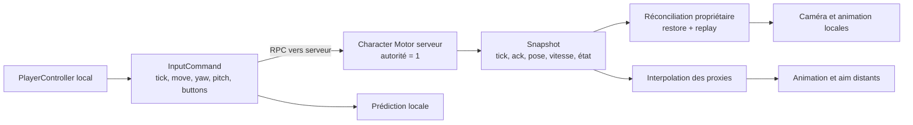

## Verdict

Le port est tout à fait viable, et le refactor actuel constitue une bonne base. En revanche, poser un `MultiplayerSynchronizer` sur `Position`/`Velocity` ne suffira pas : ce serait jouable en LAN, mais insuffisant comme socle durable.

Je recommande un modèle client–serveur autoritaire avec :

- simulation officielle sur le serveur ;
- prédiction locale et réconciliation pour le joueur propriétaire ;
- interpolation pour les Manny distants ;
- `MultiplayerSpawner` pour leur cycle de vie ;
- RPC high-level pour les commandes et snapshots ;
- `MultiplayerSynchronizer` réservé aux métadonnées simples.

L’API high-level fournit transport, RPC et réplication de scènes, mais pas automatiquement la prédiction, la réconciliation ou un modèle de physique réseau.

## Ce qui est déjà solide

Le découpage récent facilite beaucoup le port :

- L’input est échantillonné une fois dans [`CharacterPlayerController.cs`](C:/Users/pjmorel/Projects/Perso/quest-world/quest_world/character/scripts/CharacterPlayerController.cs:88).
- Le moteur consomme un `CharacterInputFrame` et produit un `CharacterFrameState` dans [`Character.cs`](C:/Users/pjmorel/Projects/Perso/quest-world/quest_world/character/scripts/Character.cs:123).
- Animation, caméra et effets sont déjà séparés du mouvement.
- La possession locale et l’activation de caméra ont leurs tests.
- Les six tests actuels passent sous Godot 4.7.1 Mono.

C’est exactement la bonne forme pour introduire une frontière réseau sans réécrire le Manny.

## Les trois modèles possibles

| Modèle | Avantage | Problème | Verdict |
|---|---|---|---|
| Client autoritaire, transform synchronisé | Très rapide à prototyper | Triche, désynchronisations, collisions contradictoires | À écarter |
| Serveur autoritaire sans prédiction | Simple et correct | Chaque mouvement attend le ping | Bon jalon technique uniquement |
| Serveur autoritaire + prédiction/réconciliation | Réactif, sécurisé, extensible | Plus complexe | Recommandé |

Godot recommande également de laisser le Character sous autorité serveur et de transférer uniquement l’autorité du nœud d’input au client. Attention : `SetMultiplayerAuthority()` ne réplique pas automatiquement ce changement ; l’owner doit être envoyé au spawn et appliqué de façon identique partout. [Documentation `Node`](https://docs.godotengine.org/en/stable/classes/class_node.html#class-node-method-set-multiplayer-authority)

## Les blocages actuels

1. **Chaque copie du Character simule actuellement la physique.**  
   [`Character._PhysicsProcess()`](C:/Users/pjmorel/Projects/Perso/quest-world/quest_world/character/scripts/Character.cs:123) n’a aucune distinction serveur, propriétaire prédit ou proxy interpolé.

2. **Le mouvement dépend directement de la caméra locale.**  
   `GetCameraRelativeDirection()` utilise le `CameraRig` local. Le serveur ne connaît pas cette orientation. La commande réseau devra transporter un yaw/pitch absolu, pas uniquement un delta souris.

3. **L’input n’est pas rejouable.**  
   `_pendingInput` contient un seul frame, ensuite effacé. Il manque :

   - numéro de tick/séquence ;
   - buffer de commandes ;
   - acquittement serveur ;
   - répétition des boutons importants jusqu’à acquittement.

4. **Les structs actuels ne constituent pas un contrat réseau.**  
   `CharacterInputFrame` et `CharacterFrameState` sont des structs C# applicatifs. Il faut les encoder en arguments RPC compatibles Variant ou `PackedByteArray`. Le synchronizer ne supporte notamment pas les propriétés `Object`/`Resource`. [Documentation `MultiplayerSynchronizer`](https://docs.godotengine.org/en/stable/classes/class_multiplayersynchronizer.html)

5. **La possession est locale, pas réseau.**  
   Les références `CharacterPlayerController` n’ont pas de sens entre processus. Il faut un `OwnerPeerId` stable.

6. **Le monde possède un Character statique.**  
   [`test_world.tscn`](C:/Users/pjmorel/Projects/Perso/quest-world/quest_world/levels/test_world.tscn:85) devra contenir un conteneur `Players` et un `MultiplayerSpawner`. Celui-ci gère spawn/despawn et les late joins depuis l’autorité. [Documentation `MultiplayerSpawner`](https://docs.godotengine.org/en/stable/classes/class_multiplayerspawner.html)

7. **La présentation distante n’a pas de source fiable.**  
   Aim pitch, facing visuel, turn-in-place, jump et landing sont actuellement dérivés de l’input/simulation locale. Un proxy devra les reconstruire depuis un snapshot autoritaire interpolé.

## Architecture cible

Dans la scène du Manny :

- racine `Character` : toujours autorité serveur ;
- `NetworkInput` : autorité du peer propriétaire uniquement ;
- `NetworkState` : autorité serveur ;
- caméra et effets : actifs uniquement pour le propriétaire local ;
- animation distante : pilotée par l’état interpolé ;
- `OwnerPeerId`, skin et position initiale : données de spawn.

Le `MultiplayerSpawner` créerait un nœud nommé avec le peer ID, garantissant des `NodePath` identiques. C’est nécessaire : les RPC Godot exigent le même chemin de nœud chez l’émetteur et le récepteur. [Documentation high-level multiplayer](https://docs.godotengine.org/en/stable/tutorials/networking/high_level_multiplayer.html)

## Contrats réseau recommandés

`InputCommand` :

- séquence et tick client ;
- mouvement 2D ;
- yaw et pitch absolus ;
- bitfield jump/sprint/actions ;
- petit historique des dernières commandes non acquittées.

`CharacterSnapshot` :

- tick serveur et dernière séquence traitée ;
- position, vitesse et yaw physique ;
- facing visuel et aim pitch ;
- grounded/sprint/airborne ;
- compteurs d’événements jump/land/turn.

Canaux initiaux :

- canal 0 fiable : spawn, despawn, possession, changement de niveau ;
- canal 1 unreliable ordered : commandes de mouvement ;
- canal 2 unreliable ordered : snapshots à 20–30 Hz ;
- canal 3 fiable : interaction, dialogue, quête et commandes gameplay.

Le Character continue à simuler à 60 Hz. Le propriétaire rejoue les commandes postérieures à l’acquittement ; les autres joueurs affichent les snapshots avec environ 100 ms de buffer d’interpolation.

## Usage des APIs Godot

- `ENetMultiplayerPeer` + `SceneMultiplayer` pour host/client.
- `MultiplayerSpawner` pour niveaux et joueurs.
- `MultiplayerSynchronizer` pour `OwnerPeerId`, apparence et métadonnées lentes.
- RPC explicites pour commandes/snapshots : ils font bien partie de l’API high-level et donnent le contrôle nécessaire.
- Même version Godot et même build côté client/serveur : le protocole `SceneMultiplayer` est un détail d’implémentation et n’est pas destiné à un serveur non-Godot. [Documentation `SceneMultiplayer`](https://docs.godotengine.org/en/stable/classes/class_scenemultiplayer.html)
- Serveur dédié avec `--headless` et preset `dedicated_server`. [Documentation dédiée](https://docs.godotengine.org/en/stable/tutorials/export/exporting_for_dedicated_servers.html)

## Ordre d’implémentation conseillé

1. Extraire une méthode de simulation explicite `Simulate(input, delta)` et séparer aim/caméra du moteur.
2. Ajouter session ENet, spawn serveur et identité réseau.
3. Faire fonctionner le serveur autoritaire sans prédiction.
4. Ajouter snapshots et interpolation des proxies.
5. Ajouter prédiction, acquittement et réconciliation du propriétaire.
6. Répliquer la fidélité visuelle complète : pitch, facing, turn, jump et landing.
7. Ajouter serveur dédié, late join, déconnexion, validation/rate limiting.
8. Exposer le contrat commun pour interaction, quête et dialogue : requête client, validation serveur, état répliqué.

## Critères pour considérer le Manny “feature complete”

- Host, client et serveur dédié produisent le même gameplay.
- Chaque peer ne contrôle et n’active que sa caméra.
- Un late join voit immédiatement tous les joueurs au bon état.
- Aucun client ne peut déplacer ou posséder le Manny d’un autre.
- Le joueur local réagit immédiatement à 100 ms de RTT.
- Les proxies restent fluides avec jitter et 2–5 % de perte.
- Jump, landing, sprint, aim pitch et turn-in-place sont visibles à distance.
- Les corrections sont mesurées et restent normalement sous 10–15 cm.
- Tests automatisés : deux clients, reconnexion, mauvais sender, input périmé, perte de paquets et parité listen/dedicated.

Je valide donc cette architecture comme cible : elle garde le Manny agréable à jouer tout en devenant une vraie fondation pour tester interaction, combat, quête et dialogue multijoueurs.

## Étape 1 — Simulation explicite

La première étape du refacto est implémentée :

- `CharacterSimulationInput` porte le mouvement, les actions et les angles de vue absolus dans l’espace local du Character.
- `Character.Simulate(input, delta)` exécute uniquement le moteur de mouvement et produit `CharacterFrameState`. Il ne lit pas le `CameraRig` et n’applique ni animation ni effets caméra.
- `_PhysicsProcess` reste l’adaptateur local : il consomme `CharacterInputFrame`, applique le look à la caméra, construit le contrat de simulation, puis applique la présentation locale.
- Le delta souris est maintenant transmis explicitement à `CharacterCameraEffects` et ne fait plus partie de l’état consommé par le moteur.

Cette frontière permet à la future couche réseau d’appeler le moteur avec un input rejouable sans dépendre d’une caméra locale. Le RPC, le spawn, les snapshots et la prédiction restent volontairement hors du périmètre de cette étape.

Note de l’audit initial : une modification non commitée de `CharacterPlayerController.cs` avait été signalée dans le worktree ; l’étape 1 ne change pas son comportement.
